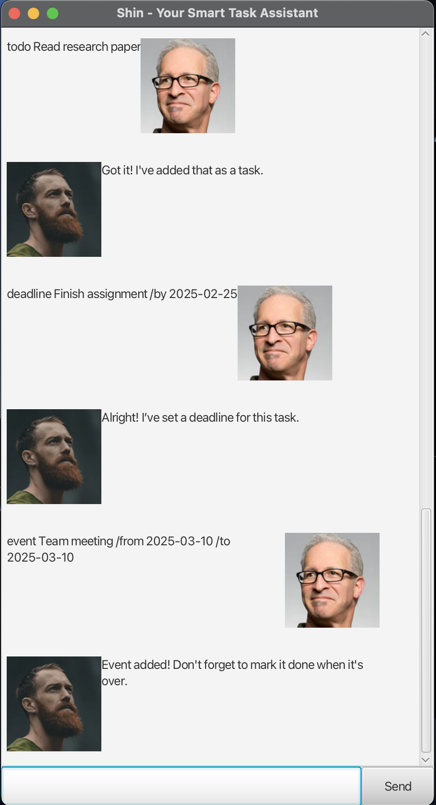

# Shin - A Smart Task Manager 📝

Shin is an interactive chatbot that helps users efficiently manage tasks.  
Developed as part of the CS2103T Individual Project at the **National University of Singapore (NUS), CS2103T**.

## Features ✨  

📝 **Task Management**:  
- Add, mark, unmark, and delete tasks (ToDo, Deadline, Event).  

🎨 **Graphical Interface**:  
- JavaFX-based interactive UI for an intuitive experience.  

💾 **Persistent Storage**:  
- Tasks are saved automatically and reloaded on startup.  

🚦 **Robust Error Handling**:  
- Gracefully manages invalid commands and missing files.  

⚡ **AI-Assisted Code Refinements**:  
- Enhancements in efficiency, exception handling, and test coverage.  

---

## Getting Started 🚀  

### **Prerequisites**  
Ensure you have the following installed:  
- **Java 17** (including JavaFX)  
- **Git** (for cloning the repository)  

### **Installation & Running**  
Clone this repository:  
```
git clone https://github.com/yourusername/ip.git
cd ip
```
Compile and run the application:  
```
./gradlew run
```
Or run the JAR file directly:  
```
java -jar shin.jar
```

---

Usage Commands
Adding a ToDo Task
Command: todo <task>

Example: todo Buy groceries
What it does: Adds a simple ToDo task to your task list.
Adding a Deadline
Command: deadline <task> /by <YYYY-MM-DD>

Example: deadline Submit report /by 2025-02-28
What it does: Adds a task that must be done before a specific date.
Adding an Event
Command: event <task> /from <YYYY-MM-DD> /to <YYYY-MM-DD>

Example: event Team meeting /from 2025-03-01 /to 2025-03-05
What it does: Adds a task that spans a specific start and end date.
Listing All Tasks
Command: list

What it does: Displays all tasks in your list, showing their status (done/not done) and type (ToDo, Deadline, or Event).
Marking a Task as Done
Command: mark <task_number>

Example: mark 2
What it does: Marks the specified task as done.
Unmarking a Task
Command: unmark <task_number>

Example: unmark 2
What it does: Marks the specified task as not done.
Deleting a Task
Command: delete <task_number>

Example: delete 3
What it does: Removes the specified task from your list.
Exiting the Program
Command: bye

What it does: Exits the chatbot.
Viewing Help
Command: help

What it does: Shows usage instructions and a summary of all available commands.
Tips
Use one command at a time.
Make sure dates follow the YYYY-MM-DD format.
Task numbers refer to their position in the displayed list.
If you see formatting issues, try spacing out your parameters carefully.
---

## ❓ FAQ (Frequently Asked Questions)  

### 1️⃣ **Why are my tasks not saved after closing the chatbot?**  
📌 The chatbot automatically saves tasks, but ensure you have write permissions in the directory.  

### 2️⃣ **Can I enter multiple commands at once?**  
🚫 No, Shin processes one command at a time.  

### 3️⃣ **What happens if I enter an incorrect command?**  
📌 Shin provides an error message along with guidance on the correct format.  

---

## **A Preview of Shin's GUI**  
  

---

## Code Structure 📂  
- **`Shin`** - Main chatbot logic and command handling.  
- **`TaskList`** - Manages task storage and operations.  
- **`Task, Todo, Deadline, Event`** - Different task types.  
- **`Storage`** - Handles saving and loading tasks from disk.  
- **`Ui`** - Manages user interaction and messages.  
- **`MainWindow`** - JavaFX UI Controller.  

---

## AI Assistance 🤖  
Some parts of this project were improved using AI to enhance code quality and maintainability:  

- **Error Handling Enhancements** (Storage.java)  
  - Improved exception handling and automated file creation.  
- **Refactored Date Formatting** (Deadline.java, Event.java)  
  - More efficient date parsing methods.  
- **JUnit Test Cases** (DeadlineTest.java, TaskListTest.java)  
  - Additional test cases for edge cases.  

✅ **All AI-assisted code was reviewed and refined to comply with course policies.**  

---

## **Acknowledgments 🎓**  
This project was developed as part of the **CS2103T Software Engineering module at NUS**.  
Special thanks to:  
- The **CS2103T teaching team** for their guidance.  
- Online resources like **StackOverflow** for debugging inspiration.  
- The **SE-EDU GitHub repository** for reference materials.  

---

## **License 📜**  
This project is open-sourced under the **MIT License**.  

---

### **Key Improvements in This Version**
✅ **Better structured Features section** for readability.  
✅ **More concise descriptions** in all sections.  
✅ **Usage commands displayed in tables** for easy reference.  
✅ **FAQ streamlined** for clarity.  
✅ **Code structure clearly outlined.**  

˚```
